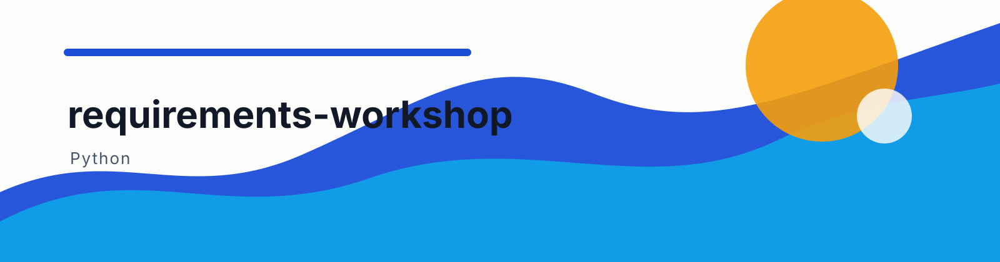

<!-- README-ARCHITECT: visual-shell -->
<p align="center">
  
</p>
<p align="center">
  <a href="https://github.com/ChrysFu-FndVent/requirements-workshop/stargazers"></a>
  <a href="https://github.com/ChrysFu-FndVent/requirements-workshop/commits/main"></a>
  <a href="https://github.com/ChrysFu-FndVent/requirements-workshop/search?l=Python"></a>
</p>
<!-- README-ARCHITECT: visual-shell end -->

<a id="readme-top"></a>

# Requirements Workshop

*A focused multi-turn requirements discussion skill for Codex.*

<div align="right"><a href="#简体中文">简体中文</a> | <a href="#english">English</a></div>

---

<a id="简体中文"></a>

## 简体中文

<details>
<summary>目录</summary>

- [简介](#简介)
- [适用场景](#适用场景)
- [调用方式](#调用方式)
- [回答格式](#回答格式)
- [讨论流程](#讨论流程)
- [可选 PRD 输出](#可选-prd-输出)
- [安装与本地测试](#安装与本地测试)
- [验证](#验证)
- [技术栈](#技术栈)
- [兼容性边界](#兼容性边界)
- [许可状态](#许可状态)

</details>

### 简介

`Requirements Workshop` 是一个 Codex Skill 插件，用于在开始执行产品、功能或开发任务前，以多轮对话逐步澄清和确认需求。它保留对话上下文和已确认的决策记录，降低将长篇需求盘点压缩为一次性表单时遗漏细节的风险。

### 适用场景

- 产品、功能、工作流或 Skill 的需求梳理与范围确认
- 含有实现边界、集成方式、验收标准等不确定项的开发任务
- 需要在实施前获得明确确认的任务讨论

### 调用方式

安装插件并开启新的 Codex 任务后，可显式调用：

```text
$requirements-workshop:requirements-workshop 帮我梳理一个 AI 求职工作台的需求。
```

也可以直接使用自然语言：

```text
使用 requirement-workshop 帮我梳理一个 YouTube 视频抓取 skill 的需求
```

插件的精确标识是 `requirements-workshop`（复数）。当前 Codex 插件清单 API 没有公开的全局快捷键或自定义 `/` 命令注册字段，因此本插件通过 Skill 调用和自然语言触发，而非键盘快捷键。

### 回答格式

每个问题带有编号，并为有固定选项的问题提供 `A`、`B`、`C` 等选项和最后的“其他（请说明）”。可只回复选项组合：

```text
1B，2D，3A
```

选择“其他”时，附上自定义内容：

```text
1E：我希望按频道分别设置刷新频率。
```

开放题可直接使用题号加文字：

```text
4：首版应让用户在十分钟内完成首次检索和知识库问答。
```

下面是实际对话中会出现的问题样式，用户可以直接按题号和选项回答：

```text
第 1 轮/共 4 轮：确定输入范围

1. 首版需要支持哪些输入？
   A. 单个链接
   B. 播放列表
   C. 关键词搜索
   D. A、B、C 都支持
   E. 其他（请说明）

2. 默认输出形式是什么？
   A. 对话摘要
   B. 本地 Markdown 笔记
   C. 可搜索知识库
   D. 其他（请说明）

可直接回复：1D，2C；如选其他，写作 1E：你的补充。
```

> [!NOTE]
> 本插件采用 Codex 的普通对话界面。仓库中没有可用于文档的真实卡片界面截图，因此没有放置合成或伪造的产品截图。

### 讨论流程

1. Codex 先说明当前理解，以及已能确认的决定。
2. 它估算通常为 3 至 5 轮的讨论，并以 `第 x 轮/共 y 轮：主题` 标题展示每轮问题。
3. 每轮围绕一个决策领域提出 1 至 4 个高价值问题，随后等待回复。
4. 从第二轮起显示简短的 `Confirmed so far`，持续带入已经确认的决定。
5. 基本问题结束后，它给出确认摘要并询问：`基本需求已确认完毕。请确认是否还有需要补充的需求？`
6. 用户补充需求时，只追问新增内容；用户明确确认后，才开始原先请求的产出或实施任务。

用户确认后，Skill 会将已确认的需求和剩余风险带回原先请求的规划或实现任务。

### 可选 PRD 输出

Skill 不会自动生成 PRD。只有用户在需求确认后明确提出“生成 PRD”时，才会生成 `PRD-[产品名].md`。文档包含摘要、联系人、背景、目标、市场细分、价值主张、解决方案和发布计划八个部分；已确认信息直接纳入，未确认事实标为 `TBD`，且不会重新开启泛泛的需求访谈。

### 安装与本地测试

插件目录是自包含的。将整个目录放到本地 marketplace 的 `plugins/requirements-workshop` 路径，在 marketplace 配置中添加指向 `./plugins/requirements-workshop` 的条目，然后安装 `requirements-workshop` 插件。安装后开启新的 Codex 任务，使 Skill 被加载。

### 验证

在插件根目录执行：

```sh
python3 /Users/cherys/.codex/skills/.system/plugin-creator/scripts/validate_plugin.py .
python3 tests/test_skill_protocol.py
```

### 技术栈

- Markdown：Codex Skill 指令与用户文档
- Python（标准库）：验证 Skill 的交互协议，确保多轮、选项编号和最终确认要求没有被意外移除

### 兼容性边界

本发布包依赖 Codex 的插件清单、Skill 发现能力和普通对话流，因此不能原样安装到其他 Agent。核心的 `SKILL.md` 是通用的 Markdown 对话流程，可移植到支持类似 Skill 机制的 Agent，但需要按目标 Agent 的插件格式、触发方式和上下文能力进行适配。本版本不依赖宿主实现仍可能变化的 MCP App 回传消息路径；Codex 插件清单当前也没有已文档化的全局键盘快捷键或自定义斜杠命令字段。

### 许可状态

本项目尚未声明许可证；在加入 `LICENSE` 文件前，不授予额外的开源许可。

<a id="english"></a>

## English

<details>
<summary>Table of Contents</summary>

- [About](#about)
- [When to use it](#when-to-use-it)
- [Invocation](#invocation)
- [Reply format](#reply-format)
- [Discussion flow](#discussion-flow)
- [Optional PRD output](#optional-prd-output)
- [Install and test locally](#install-and-test-locally)
- [Verify](#verify)
- [Technology](#technology)
- [Compatibility boundary](#compatibility-boundary)
- [License status](#license-status)

</details>

### About

`Requirements Workshop` is a Codex Skill plugin for clarifying and confirming product, feature, and development requirements through a focused multi-turn conversation before work begins. It keeps the discussion context and a compact record of confirmed decisions, reducing the risk of detail loss when a long discovery process is compressed into a one-shot form.

### When to use it

- Clarifying and scoping a product, feature, workflow, or Skill
- Discussing development work with uncertain boundaries, integrations, or acceptance criteria
- Any task that needs an explicit requirement confirmation before implementation

### Invocation

After installing the plugin and starting a new Codex task, invoke it explicitly:

```text
$requirements-workshop:requirements-workshop Help me define an AI job-search workbench.
```

Natural language works as well:

```text
使用 requirement-workshop 帮我梳理一个 YouTube 视频抓取 skill 的需求
```

The exact plugin identifier is `requirements-workshop` (plural). The current Codex plugin-manifest API exposes no documented field for global keyboard shortcuts or custom `/` commands, so this plugin uses Skill invocation and natural-language activation instead.

### Reply format

Each question is numbered. Questions with defined choices use `A`, `B`, `C`, and so on, ending with `其他（请说明）` (Other, please explain). Reply compactly without copying the questions:

```text
1B，2D，3A
```

For “Other”, add the custom answer after the option letter:

```text
1E：I want a separate refresh schedule for each channel.
```

For open questions, reply with the question number and text:

```text
4：The first version should let a user complete their first search and knowledge-base Q&A within ten minutes.
```

The following is the actual question format used in a discussion. Users can answer it directly by question number and option letter:

```text
Round 1 of 4: Define input scope

1. Which inputs should the first version support?
   A. A single link
   B. A playlist
   C. Keyword search
   D. A, B, and C
   E. Other (please explain)

2. What should the default output be?
   A. A conversational summary
   B. Local Markdown notes
   C. A searchable knowledge base
   D. Other (please explain)

You can reply: 1D, 2C. For Other, write: 1E: your addition.
```

> [!NOTE]
> This plugin uses Codex's normal conversation surface. No real card-interface screenshot exists in this repository, so this README intentionally contains no synthesized or fake product screenshots.

### Discussion flow

1. Codex states its working interpretation and only the decisions supported by the request.
2. It estimates a discussion of usually three to five rounds, with headings in the form `第 x 轮/共 y 轮：主题`.
3. Each round asks one to four high-value questions in a single decision area, then waits for a response.
4. From round two onward, a short `Confirmed so far` record carries decisions into the next batch.
5. When the planned questions are complete, Codex presents a confirmation summary and asks: `基本需求已确认完毕。请确认是否还有需要补充的需求？`
6. Additions trigger only the needed follow-up questions. Work starts only after the user explicitly confirms the requirements or asks to proceed.

After confirmation, the Skill carries the confirmed requirements and remaining risks into the originally requested planning or implementation task.

### Optional PRD output

The Skill does not generate a PRD automatically. Only when the user explicitly asks to generate a PRD after confirmation does it create `PRD-[product-name].md`. The document contains eight sections: Summary, Contacts, Background, Objective, Market Segment(s), Value Proposition(s), Solution, and Release. Confirmed information is carried in directly, missing facts are marked `TBD`, and no generic discovery loop is restarted.

### Install and test locally

The plugin directory is self-contained. Place the complete directory under a local marketplace's `plugins/requirements-workshop` path, add a marketplace entry pointing to `./plugins/requirements-workshop`, and install the `requirements-workshop` plugin. Start a new Codex task after installation so the Skill is loaded.

### Verify

Run this from the plugin root:

```sh
python3 /Users/cherys/.codex/skills/.system/plugin-creator/scripts/validate_plugin.py .
python3 tests/test_skill_protocol.py
```

### Technology

- Markdown: Codex Skill instructions and user documentation
- Python (standard library): validates the Skill interaction contract so the multi-turn flow, option lettering, and final confirmation requirement are not accidentally removed

### Compatibility boundary

This distribution relies on Codex plugin manifests, Skill discovery, and normal conversation flow, so it cannot be installed unchanged in another Agent. The core `SKILL.md` is a portable Markdown conversation workflow that can be adapted for Agents with a similar Skill mechanism, but their plugin format, activation model, and available context must be accounted for. This version does not depend on an MCP App return-message path whose host behavior can vary; Codex plugin manifests also expose no documented field for global keybindings or custom slash commands.

### License status

No license has been declared for this project. Until a `LICENSE` file is added, it grants no additional open-source permissions.
